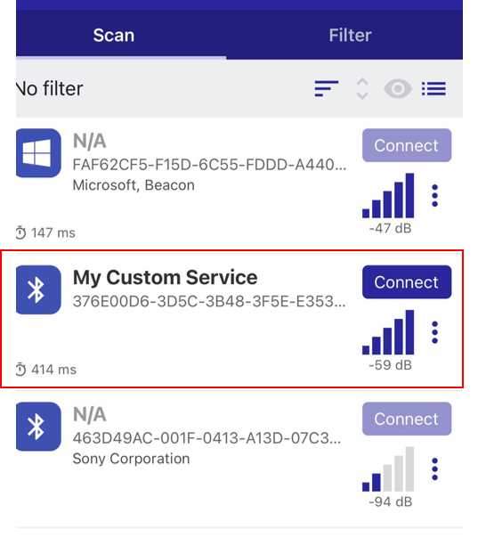
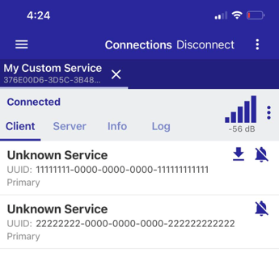
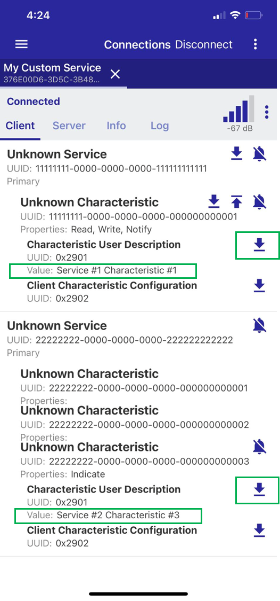
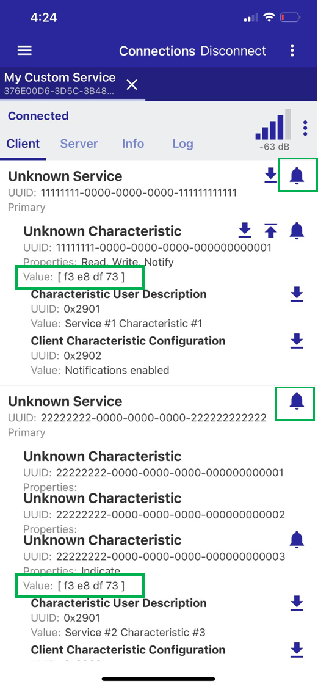
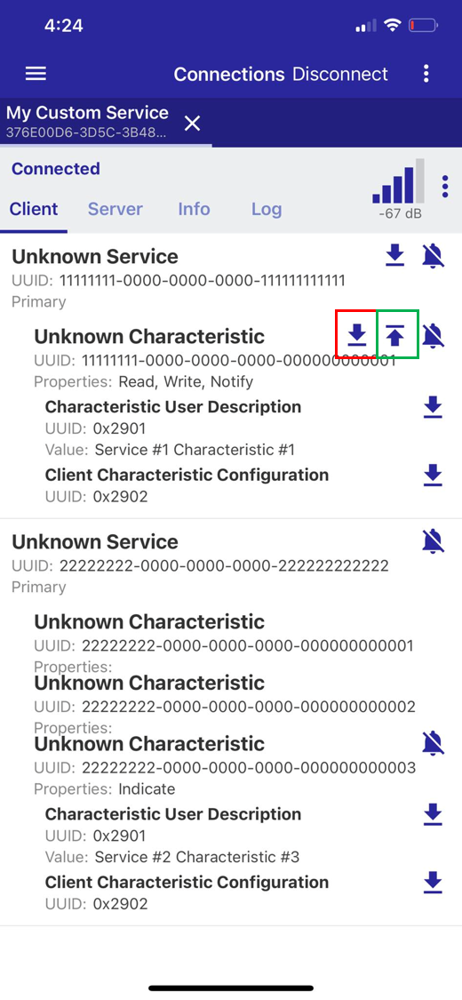
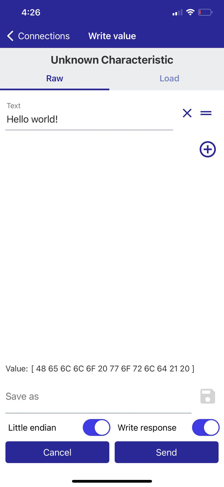
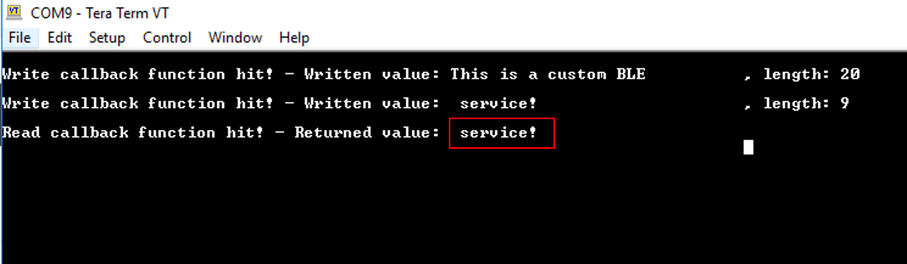

# Bluetooth Custom Service Framework

## Example Description

This application demonstrates a sophisticated way of creating custom Bluetooth databases. The core mechanism is responsible for creating, initializing and registering attributes to the ATT database hosted by the Bluetooth controller. On top of that mechanism, a easy-to-use abstraction layer has been implemented hiding all the complexity and thus, facilitating developers to create their services in a relative short time.

For demonstration purposes two service attributes, each consisting of arbitrary characteristic attributes, are defined in the custom Bluetooth database. The user is free to add as many characteristic attributes as needed or modify the existing ones. The only limitation is the available memory space that should accommodate all the resources required by the Bluetooth database. It is important to note that attribute values should be handled explicitly by developers. That is, the demonstrated  framework does not support handling attribute values transparently (e.g. store them in the flash memory used). 

## HW and SW Configuration

- **Hardware Configuration**
  - This example runs on DA14592 family of devices.
  - A Pro DevKit is needed for this example.
- **Software Configuration**
  - Download the latest SDK version for the target family of devices.

  - Download latest version of e2studio
  
  - SEGGER J-Link tools are normally downloaded and installed as part of the e2 Studio installation.

## How to Run the Example

### Initial Setup

- Clone the example from GitHub repository.
- Import the project into your workspace (there should be no path dependencies).
- Connect the target device to your host PC via USB1. The mentioned port is used to power the device via VBAT and also to support debugging functionality (UART and JTAG)
- Compile the code and load it into the chip.
- Open a serial terminal (115200/8 - N - 1)
- Press the reset button on DevKit to start executing the application.
- Open Renesas SmartBond App, connect to the device and start exploring the custom database.
  - Verify that the advertising device is reported by the SmartBond App. This can be achieved by looking at the advertising data reported (i.e. `My Custom Service`)

Press `Connect` to connect to the device. The two custom service attributes (primary services) along with their 128-bit UUIDs should be displayed.   Please note that an arbitrary 128-bit UUID should be displayed as `Unknown Service`

Expand each of the primary service by tapping on it. The characteristic attributes should be displayed. Press the down arrow, marked with the green box, to verify the user description values.

Enable notifications for each of the primary services so the SmartBond App can get notified as soon as a characteristic value is changed. To do so, tap on the ring icon, marked with the green box. For demonstration purposes, an OS timer is configured to trigger notification events every 1 second (the frequency can be adjusted via `CHARACTERISTIC_ATTR_UPDATE_MS`).

Disable notifications (if already enabled) and start interacting with the first primary service that allows read and write accesses to its characteristic attribute value. Tap on the down arrow, marked with the red box, to send a read request to the remote attribute database. DA14592 should reply with the attribute's current value. The `characteristic_attr_read_cb` callback should be fired and the serial console should be updated accordingly.

Tap on the up arrow, marked with the green box, to update the characteristic attribute value. DA14592 will receive the new value and store it.  The `characteristic_attr_write_cb`callback should be fired and the serial console should be updated accordingly. 

**NOTE:** According to the Bluetooth core specifications when a peer device attempts to send more than 20 bytes to the peripheral device, the `Prepare Write Request` Bluetooth event is invoked and the written value is split into chunks of 20 bytes which are sent one by one. When all data packets are received, the peripheral device concatenates and delivers them as a unified message to upper layers. However, some scanner APPs may split the written value into chunks of 20 bytes and send them using separate write requests (without invoking a Prepare Write Request event). If this is the case, you should expect to get a similar output on the serial console:

## Known Limitations

There are no known limitations for this application.
