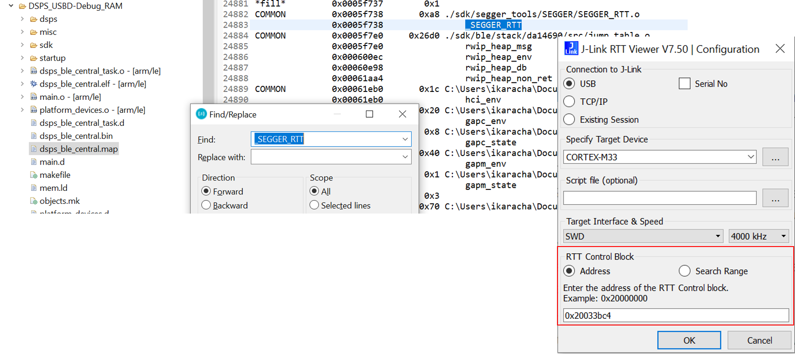
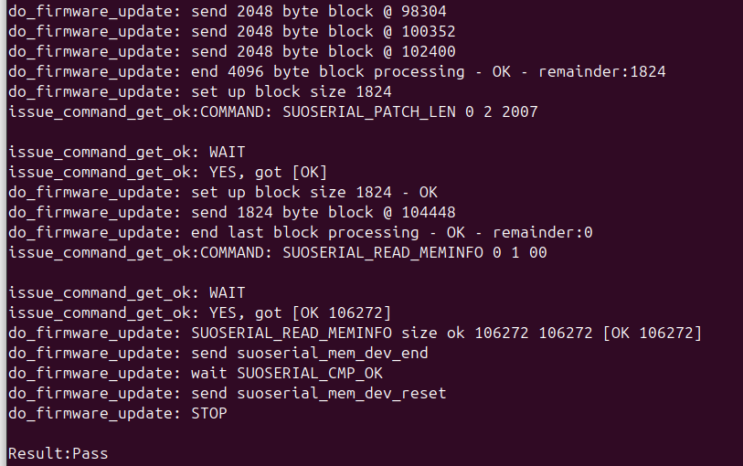
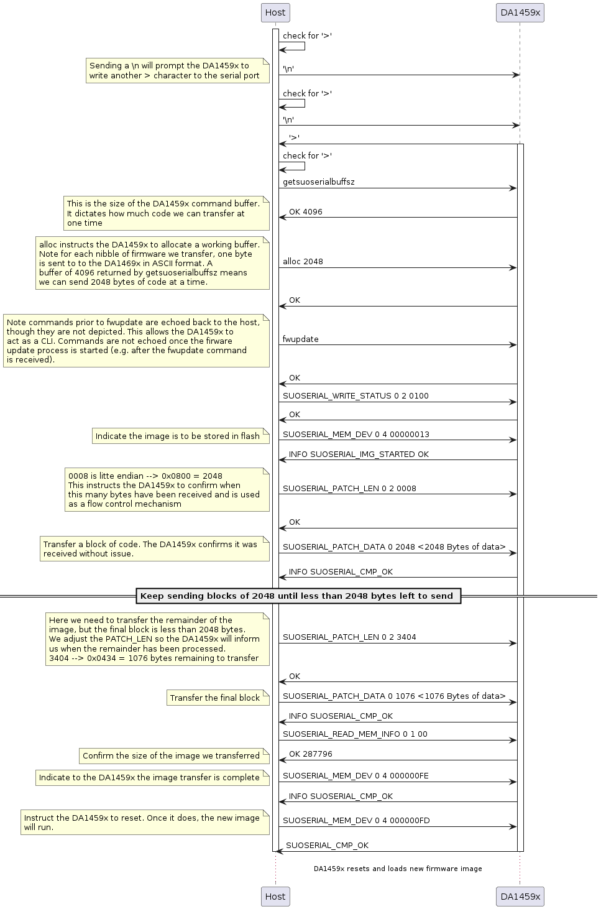
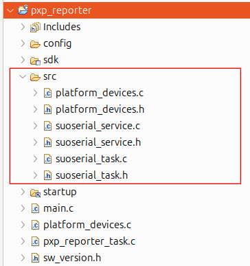
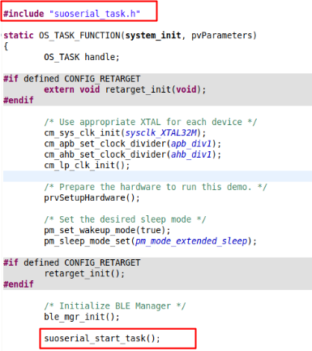
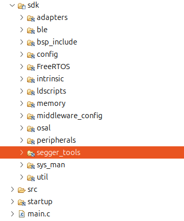
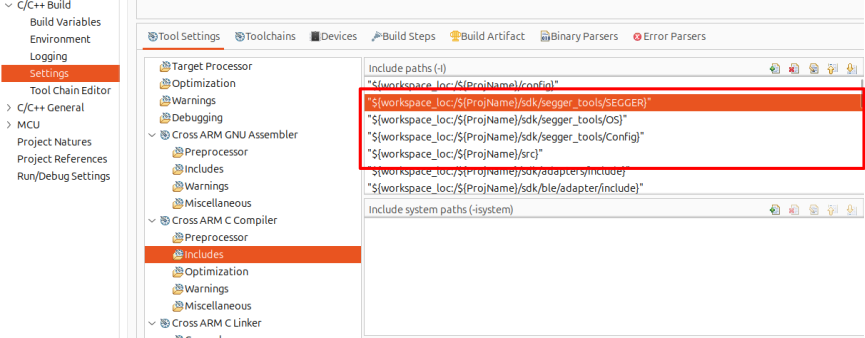

SUOSERIAL Demonstration Example{#suouart}
======================

This example demonstrates Software Update over UART, namely `SUOSERIAL`. The application has been ported from the DA1469x family of devices which also supports Software Update over USB. The same name convention is chosen here as more serial interfaces might be supported in the future. An executable, namely `host_suoserial`, is provided to run the example with a development kit connected to a PC which runs either Windows or Linux OS. The source code used to create this executable is provided in `host_suoserial.c`

## HW and SW Configuration

  - **Hardware Configuration**
    - This example runs on the DA1459x family of devices.
    - A [Pro Development Kit](https://www.renesas.com/us/en/products/wireless-connectivity/bluetooth-low-energy/da14592-016fdevkt-p-smartbond-da14592-bluetooth-low-energy-52-soc-development-kit-pro) (DevKit) is needed for this example.
  - **Software Configuration**
    - Download the latest [SDK](https://www.renesas.com/us/en/products/wireless-connectivity/bluetooth-low-energy/da14592-smartbond-multi-core-bluetooth-le-52-soc-embedded-flash?gad_source=1) version for the target family of devices.

    - SEGGER J-Link tools are normally downloaded and installed as part of the [e2 Studio](https://www.renesas.com/us/en/software-tool/smartbond-development-tools) installation.

## How to run the example

### Initial Setup

- Download the source code from [GitHub](https://github.com/dialog-semiconductor/BLE_SDK10_DA1459x_examples). 

- Import the project into your workspace (there should be no path dependencies). If you are not familiar with these processes it's advised that you first familiarize yourself with the [Getting Started](https://lpccs-docs.renesas.com/um-b-166-da1459x_getting_started/index.html) guide.

- Connect the target device to your host PC via USB1. The mentioned port is used to power the device and to support serial and JTAG interfaces. These two interfaces can be used both for flashing and debugging purposes.

- This example employs the `SUOTA` flash partition so that there is room for both the current and update firmwares. As such, it's imperative that the flash memory be erased before flashing the target application. This is imperative every time a new flash partition is loaded.

- Compile the source code (either in Release or Debug mode) and flash it into the chip. Please note that the debug flavor should be used merely for debugging purposes since it should increase the generated binary file, significantly. In addition, the source code is built to work with the embedded flash Working with external flash memory devices is out of the scope of this demonstration example.  

- Once the application image is flashed, press the RESET button on the daughter board to start executing the application. 

- Open a command prompt at `<path_on_your_machine>/suoserial_sample_code/suoserial_host`. 

- If the host runs on a Windows machine hit `host_usb.exe <COM port> pxp_reporter.1.0.0.1.img -verbose`.
  - Where `COM port` is the lower virtual COM port of Pro Development Kit. 
  - `pxp_reporter.1.0.0.1.img` is a pre-compiled proximity reporter SDK sample code that integrates the SUOSERIAL service. That means that, once the FW update completes a new SW update over UART can take place. The modified proximity reporter is delivered zipped in `pxp_reporter_suoserial.zip`.
  - Debug message can be enabled with the `-verbose` option.

- Optionally, open the SEGGER JLink RTT Viewer to get various debug messages. To do so, the `_SEGGER_RTT` symbol address should be retrieved from the generated `.map` file and be filled in the address field of the viewer as depicted below:  

  

  

- If the verbose functionality is enabled various info should be displayed throughout the update process: 



Once the update process is completed successfully, DA1459x will reset and start advertising the `pxp_reporter` application. 


### Command Flow Overview

The below sequence diagram provides of an overview of the commands/responses exchanged between the `host_suoserial` executable running on the PC and the DA1459x running the `suoserial` service. 



### Adding Support for the SUOSERIAL Service

This section briefly explains the steps needed to modify a SUOTA application, e.g. proximity reporter, that is built with `USE_PARTITION_TABLE_EFLASH_WITH_SUOTA`or `USE_PARTITION_TABLE_4MB_WITH_SUOTA`:

1. Copy the `src`folder of the SUOSERIAL sample code into the target application project. 

2. Remove `main.c` as this file should already exist in the target application project. The `src`folder should now contain the following items:

    

3. Add the `src`folder in the project's path so its contents are visible to other files.
4. Open application's main source file and call the following API in system initialization routine:



5. Open the custom configuration file e.g. `custom_config_eflash_suota.h` and add the following contents (make sure there are no double macro definitions).

   ```
   #define dg_configUART_ADAPTER                   ( 1 )     /* Enable the UART Adapter abstraction layer and API */
   
   /* Enable circular DMA so no data are overwritten in the RX HW FIFOs upon file transfers. */
   #define dg_configUART_RX_CIRCULAR_DMA           ( 1 )
   /* This value has been adjusted so that no data loss is encountered in file transfer operations. */
   #define dg_configUART2_RX_CIRCULAR_DMA_BUF_SIZE ( 1024 )
   
   #if (dg_configUART_ADAPTER == 1)
   #undef CONFIG_RETARGET
   /*
    * Use the RTT mechanism to interact with the outside world e.g. log messages.
    * RETARGET operations employ the serial port which should raise conflicts
    * with the SUOSERIAL service.
    */
      #define CONFIG_RTT
      #endif
   
   #define dg_configSUOUART_SUPPORT                 ( 1 )
   
   #if (dg_configSUOUART_SUPPORT == 1)
   /*
    * Once the SUOUART task is executed there will be no time for lower
    * priority tasks (typically that should be the idle task) to execute
    * and thus denoting its presence to the WDOG service. Therefore, it's
    * imperative that WDOG monitoring for these tasks be disabled since
    * there is no API to get the IDLE task's WDOG ID. Otherwise, the
    * idle task's monitoring would just be suspended as long as SUOUART
    * was up and running.
    */
      #define dg_configWDOG_GUARD_IDLE_TASK            ( 0 )
      #endif
   ```

6. If SEGGER RTT is enabled, make sure the appropriate source files are linked under the `sdk` folder and project's paths are updated accordingly as illustrated below:

   

   