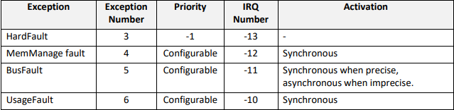
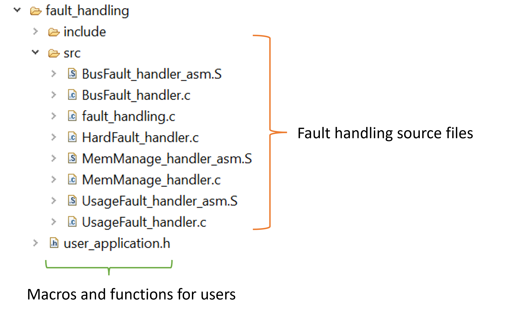
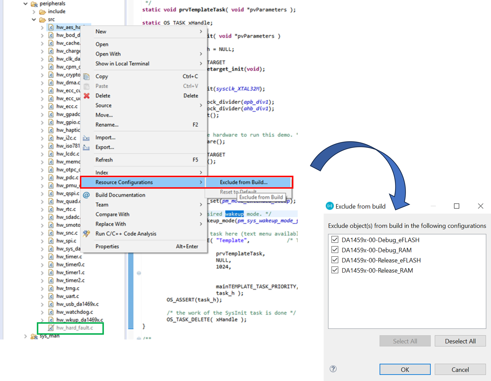
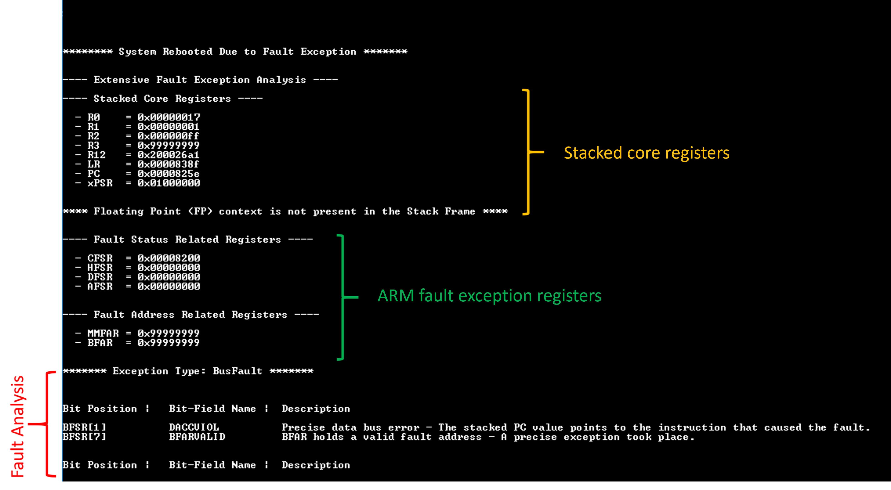

# ARMv8 Fault Handling Demonstration Example

## Example Description

This example code demonstrates dealing with fault exceptions on the ARMv8 architecture. The DA1459x Bluetooth SoC integrates an ARM-Cortex M33 used to run the application firmware. In contrast to other simpler MCU architectures, ARMv8 features more sophisticated fault exception handling mechanisms employed when an erratic behavior is detected. The following picture illustrates the most common exceptions supported by the ARMv8 architecture.

## Application Description

The SDK of the DA1459x family of devices exhibits primitive fault exception analysis for the majority of the fault exceptions. However, programmers can define their own exception handlers implementing full stack trace analysis along with other application-specific tasks. Dealing with fault exceptions involves a combination of pure assembly language as well as C written routines.   All macros as well as subroutines that can be used by the users are declared in `fault_handling\user_application.h`.

The demonstration example exploits the command line interface (CLI) module provided by SDK. To facilitate developers, a set of routines are available and can be used to trigger different fault exception events as follows:

| Commands          | Description                                                  |
| :---------------- | ------------------------------------------------------------ |
| `busfault`        | Should trigger a bus fault event by writing to an invalid memory address. |
| `usagefault`      | Should trigger a usage fault event by performing an un-aligned memory access. |
| `hardfault`       | Should trigger a hard fault event by executing a breakpoint. This should be valid only when a debugger is not attached and so RAM builds should not do the trick. |
| `memmanage_fault` | Should trigger a memory management fault by attempting to write to a read-only memory address. MPU initialization is required for this task. |
| `escalated_fault` | Should trigger a usage fault exception from within a bus fault exception handler. Nested exceptions of the same or lower priority should be escalated to hard faults with the `FORCED` flag asserted. |
| `task_overflow`   | Should force the current task to overflow so that PSP reaches the programmed PSPLIM (done by OS). This should result in raising a usage fault exception. |
| `stack_overflow`  | Should force the `SysTick` interrupt to fire so that the active stack is switched to MSP. A recursive function is then called so MSP reaches the programmed MSPLIM.  This should result in raising a usage fault exception. **Please note that** **MSPLIM is not configured by default. Therefore, programmers should explicitly access MSPLIM and assign the stack limit value**, **that is `__StackLimit`.** **To do so, the accompanied patch, namely `armv8_msplim_support_sdk_changes` should be applied.** |

Users are free to expand the menu by adding their own callback functions. Once a fault is triggered a full stack trace is performed by the corresponding exception handler. There are two main fault handling flavors:

- **FAULT_HANDLING_MODE == 2** (default): The CPU state is stored in a dedicated uninitialized area in SYSRAM. A forced reboot (HW reset) takes place so that the system can recover. After rebooting, `system_boot_status_check_and_analyze` is called. If the system rebooted due to a fault event a basic fault analysis is performed with the results displayed on the serial console.
- **FAULT_HANDLING_MODE == 1**: The code execution is trapped in an infinite loop or breakpoint so the user can attach the debugger and perform a full debugging session. 

## HW and SW Configuration

  - **Hardware Configuration**
    - This example runs on DA14592 family of devices.
    - A Pro development kit is needed for this example.
  - **Software Configuration**
    - Download the latest SDK version for the target family of devices.

    - SEGGER J-Link tools are normally downloaded and installed as part of the e2 Studio installation.

## How to run the example

## Initial Setup

- Download the source code from the Support Website.

- Import the project into your workspace (there should be no path dependencies).

- Connect the target device to your host PC via USB1. The mentioned port is used to power the device via VBAT and also to support debugging functionality (UART and JTAG).

- For this example to work, the `hw_hard_fault.c` source file has been excluded from build to avoid redeclaration errors. Excluding a file is achieved by right clicking on the source file of interest and selecting **Resource Configurations --> Exclude from Build...** Another way to deal with functions re-declaration is to mark the default functions as `__WEAK`. In doing so, application can re-declare a function of the same name. 

  

- Apply the accompanied patch file, namely`armv8_msplim_support_sdk_changes`, so the MSPLIM guards are enabled. To do so:

  - open a git window in your working workspace, 

  - make sure the workspace is initialized by hitting `git init` 

  - apply the patch by hitting `git apply <relative_path_to_patch_location>`

  - get the status by hitting `git status` and make sure that `sdk/bsp/startup/DA1459x/GCC/exception_handlers.S` has been modified.

- Compile the code (either in Release or Debug mode) and load it into the chip.

- Open a serial terminal (115200/8 - N - 1)

- Press the reset button on the daughterboard to start executing the application. 

- One the serial console enter a valid command handler and press enter. The device should reboot after a while and a fault analysis, consisting of three sections, should be displayed as follows:

- The core registers stacked on exception entrance (orange color). The context of the floating point (FP) registers will be displayed in case an FP instruction was in progress the moment the fault took place.

- The most critical CPU status registers (green color).
- A quick analysis of the fault event (red color). This step takes place after rebooting the system.

With the above information and a debugger attached on the target device one can identify the cause of the fault. However, there are cases in which it's hard to determine the cause of a fault, for instance in case of an imprecise fault. In such cases, the fault will not necessarily occur concurrently with the instruction that causes the fault. The analysis of such faults are out of scope of the demonstrated example and so, there are not explained.

## Known Limitations

There are no known limitations for this sample code.