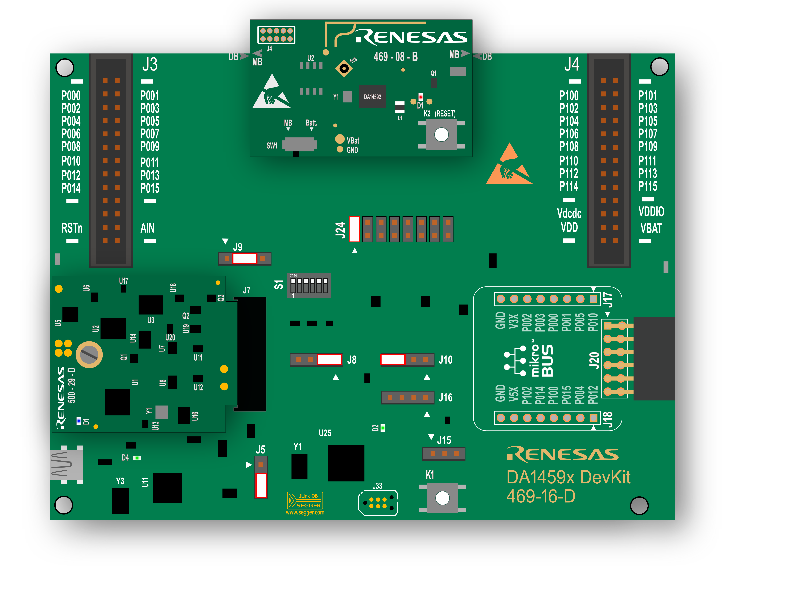

# Example Demonstrating the GPADC Adapter

## Overview

   This application demonstrates using the GPADC peripheral with the help of the GPADC adapter layer. It is recommended that an adapter mechanism is used, where available, as the latter takes care of major tasks, that otherwise should be handled by developers explicitly (and many times with the correct order). These tasks involve, among others, handling I/O pins, initializing and de-initializing a HW block instance, acquiring system resources (e.g. DMA channels) as well as preventing the device from entering the extended sleep state for as long as a peripheral is actively used. The DA14695 family of devices integrates a single GPADC block instance which can be used for single-ended and differential conversions. The GPADC block can be configured so it can measure internal power sources such as the internal DIE temperature sensor and VBAT level. For more information on the underlying block please refer to the datasheet.  

   In this example a single OS task is created which is responsible for measuring the DIE temperature every second. The measurement frequency can be adjusted via GPADC_MEASUREMENT_MS. The GPADC block is firs initialized/opened an a single ADC conversion is performed in a blocking manner. That is the task is blocked for as long as the conversion is in progress. Keep in mind that the adapter layer offers the corresponding non-blocking API flavor. If this is the case, then developers should explicitly make sure that no further operations are performed till the current one is complete. Typically, this is achieve by registering a callback function which is called once the requested conversion(s) is done (usually within ISR context). Then, the retrieved raw ADC value is translated to temperature by calling the corresponding API provided by the adapter layer which is then printed out (retarget operations are enabled by default). Finally, the GPADC adapter is closed so the device can enter the extended sleep state and thus, achieving the best power performance. For more info please read the in-line comments throughout the source code. The sample code demonstrates a recommended way for closing an adapter. The GPADC adapter also supports performing ADC conversions with the help of the GPDMA accelerator.  To enable this feature, dg_configGPADC_DMA_SUPPORT should be set in custom_config_xxx.h (disabled by default). 

## HW and SW Configuration

- **Hardware Configuration**
  - This example runs on DA14592 Bluetooth Smart SoC devices.
  - The Pro DevKit is needed for this example.

  

- **Software Configuration**
- Download the latest SDK version for the target family of devices. This example has been tested with SDK_10.1.2.86.
  
- **SEGGER J-Link** SEGGER tools are normally downloaded and installed as part of the Smart Snippets Studio installation.

## How to Run the Example

### Initial Setup

- Download the source code from the Support Website.

- Import the project into your workspace (there should be no path dependencies).

- Connect the target device to your host PC via **USB1**. The USB socket mounted on the motherboard is used to power the device (via VBAT input source) as well as connect the device to the serial interface.

- Compile the code and load it into the chip.
- Open a serial terminal (115200/8 - N - 1)
- Press the reset button on DevKit to start executing the application. The DIE temperature should be printed out every second. 

## Known Limitations

There are no known limitations for this application.
