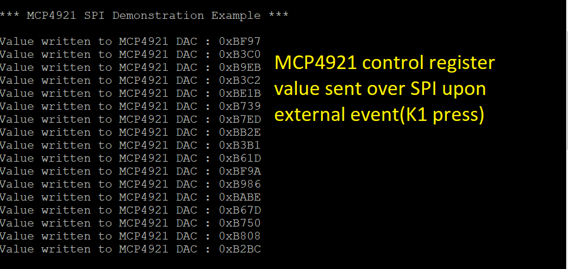

SPI Adapter Sample Code
=======================

## Example description

This application demonstrates using the SPI adapter concept. The sample code makes use of an SPI-compatible module, that is the MCP4921 DAC (digital-to-analog converter). A digital multimeter is used to verify the analog output generated.

### HW & SW Configurations

- **Hardware Configurations**
  - This example runs on a DA14592 Bluetooth Smart SoC.
  - A DA14592 Pro DevKit is needed for this example.
  - DAC Click boarch with MCP4921.
- **Software Configurations**
  - Download the latest SDK version
  - Downlaod latest version of e2studio.

## How to run the example

### Initial Setup

- Download the source code from the Github.

- Import the project into your workspace.

- Connect the target device to your host PC.

- Connect the DAC module to the Pro DevKit as illustrated below.

   
  you can get more details about the DAC module https://www.mikroe.com/dac-click

- Compile the code and load it into the chip.

- Open a serial terminal (115200/8 - N - 1)

- Press the reset button on DevKit to start executing the application.

- Press the **K1** button on the Pro DevKit.  A debugging message is displayed on the console indicating the status of the current SPI operation as well as the data (2 bytes) sent to the DAC module. The analog output value of the selected DAC channel, by default channel B, should be changed randomly.

## Known Limitations

There are no known limitations for this application.
