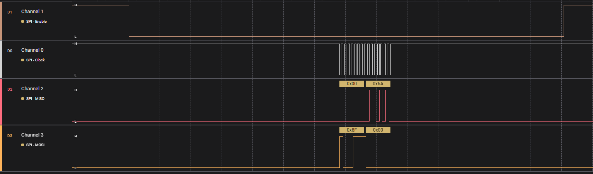
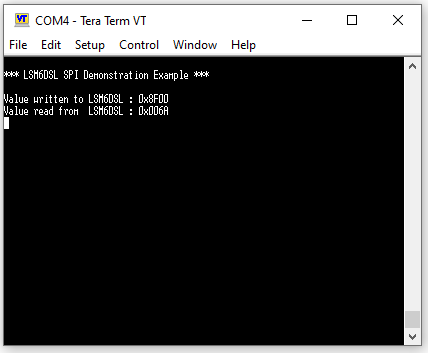

SPI Adapter Write Read Example
==============================

## Overview

This example implements a simple write and read communication scenario over 
the SPI interface using the SPI adapter layer. For this demonstration the LSM6DSL ClickBoard is used. For more details about this module, you can visit [this link](https://www.mikroe.com/lsm6dsl-click).

The SPI interface is configured in the master role while LSM6DSL is used as an SPI slave. Button K1 is configured as a Wake Up button.

Upon pressing the K1 button, the SPI master begins a write operation to transmit a read command for accessing the WHO_AM_I register. Following this, it initiates a read operation to retrieve the value of the WHO_AM_I register. The data that is written and subsequently read is then displayed on the UART terminal.

## HW and SW configuration
* **Hardware configuration**

    - This example runs on the DA14592 Bluetooth Smart SoC devices.
    - The DA14592 Pro Development kit is needed for this example.
    - Connect the Development kit to the host computer.
    - Make sure the right jumpers are placed on J15 and J16.

**UART terminal with the following settings is needed to observe the master task printouts**

        | Setting      | Value    |
        |:------------:|:--------:|
        | Baudrate     | 115200   |
        | Data bits    | 8        |
        | Stop bits    | 1        |
        | Parity       | None     |

**The following pin configuration is according to the ClickBoard connector provided on the DA14592 Development kit. The pins settings are located in `peripheral_setup.h`**

        | DA14592      | LSM6DSL      |
        |:-----------: |:------------:|
        | Master       | Slave        |
        | P0_00 (CS)   |  CS          |
        | P0_01 (CLK)  |  SCK         |
        | P0_02 (MISO) |  SDO         |
        | P0_03 (MOSI) |  SDI         |

                                 ___________________
                                |       LSM6DSL     |
                                |                   |
                                |  CS  SCK SDO  SDI |
                                |___________________|     
                                   |    |   |    |                       
     _____________                 |    |   |    |        
    |          CS |----------------'    |   |    |
    |          CLK|---------------------'   |    |
    |DA14592  MISO|-------------------------'    |
    |         MOSI|------------------------------'
    '_____________'

* **Software configuration**
  - e²Studio 2023-10  or greater.
  - SDK 10.1.2.x
  - **SEGGER J-Link** tools should be downloaded and installed.

## How to run the example

### Initial Setup

- Download the source code from the Github.
- Import the project into your workspace.
- Compile and launch eFLASH target.
- Program the eFLASH and run the example.

Logic analyzer trace of SPI operation:

The UART will show the following output on K1 button press:

	 